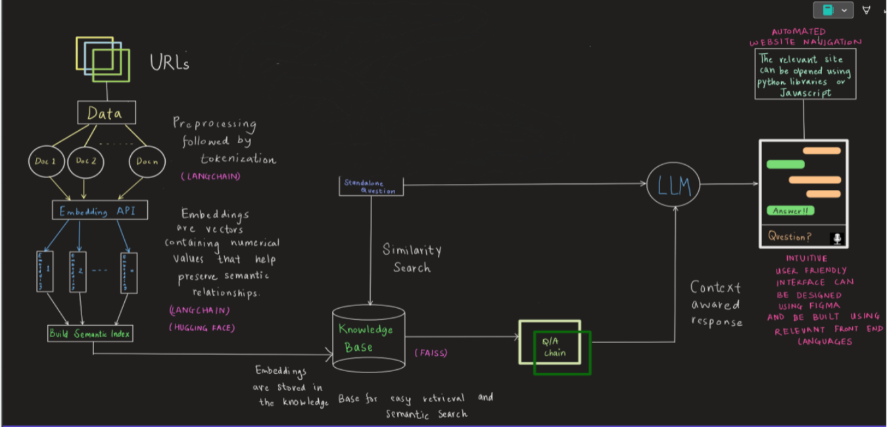
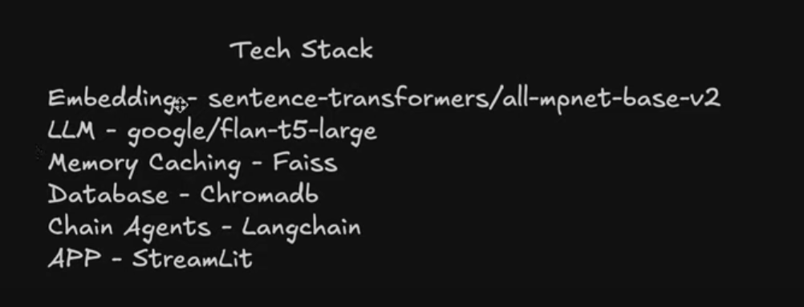

Here’s an updated and improved version of your `README.md`:

---

# Hog RAGger

## Table of Contents
- [Overview](#overview)
- [Installation](#installation)
- [Usage](#usage)
- [Dataset](#dataset)
- [RAG Pipeline](#rag-pipeline)
- [Requirements](#requirements)
- [License](#license)

## Overview

**Hog RAGger** is a Streamlit-based interactive application designed for natural language processing (NLP) tasks, with a primary focus on Retrieval-Augmented Generation (RAG). The app allows users to explore machine learning models built using the LangChain and Hugging Face ecosystems. The objective is to build a RAG pipeline that effectively answers complex queries by pulling evidence from multiple sources.

The app supports query processing and evidence extraction from a pre-defined corpus of articles, leveraging embeddings, model inference, and metadata retrieval.



Here is a section for your tech stack based on the image you provided:

---

## Technologies Used

The Hog RAGger project leverages a variety of technologies to build a robust and efficient Retrieval-Augmented Generation (RAG) pipeline. The key technologies used are:

- **Embeddings**: [sentence-transformers/all-mpnet-base-v2](https://huggingface.co/sentence-transformers/all-mpnet-base-v2) - For embedding queries and documents into vector space for efficient similarity searches.
  
- **LLM (Large Language Model)**: [google/flan-t5-large](https://huggingface.co/google/flan-t5-large) - The core language model used for generating responses and performing inference based on the retrieved evidence.
  
- **Memory Caching**: [Faiss](https://github.com/facebookresearch/faiss) - A library used for efficient similarity search and clustering of dense vectors, ensuring fast retrieval of relevant documents.
  
- **Database**: [ChromaDB](https://github.com/chroma-core/chroma) - Used as the primary vector database for storing embeddings and metadata, enabling fast and accurate retrieval of documents.
  
- **Chain Agents**: [LangChain](https://github.com/hwchase17/langchain) - Provides the infrastructure for chaining multiple agents together to enable retrieval and generation workflows.

- **App Interface**: [Streamlit](https://streamlit.io) - A user-friendly interface to interact with the RAG pipeline, making it easy to test and explore different queries.

---


## Installation

To set up the Hog RAGger app, follow these steps:

1. Clone the repository:
    ```bash
    git clone https://github.com/shrey7ansh07/InterIIT.git
    cd InterIIT
    ```

2. Create and activate a virtual environment (recommended):
    ```bash
    python -m venv venv
    source venv/bin/activate  # On Windows: venv\Scripts\activate
    ```

3. Install the required packages:
    ```bash
    pip install -r requirements.txt
    ```

## Usage

To run the application, execute the following command in your terminal:

```bash
streamlit run app.py
```

## Dataset

### Hog RAGger Dataset

This project utilizes two key datasets:

- **Corpus.json**: Contains a collection of web-scraped articles. Each entry includes:
  - `title`: Title of the article.
  - `author`: Author(s) of the article.
  - `source`: The source publication or website.
  - `published_at`: The publication date and time.
  - `category`: The category (e.g., technology, business).
  - `url`: The link to the article.
  - `body`: The article’s main text content.

- **Train.json**: Contains 2,556 queries from a state-of-the-art RAG pipeline. Each query is accompanied by evidence spread across 2 to 4 documents. The goal is to match the format of this output, which includes:
  - `query`: The question being asked.
  - `answer`: The system's inferred response based on evidence.
  - `question_type`: Type of question (e.g., "inference_query").
  - `evidence_list`: A list of sources used to support the answer, with metadata such as title, author, source, publication date, category, and URL.

## RAG Pipeline

Hog RAGger's goal is to develop a robust Retrieval-Augmented Generation (RAG) pipeline that responds to user queries by extracting relevant information from a corpus of documents. The pipeline:
- Processes the query and retrieves documents containing relevant evidence.
- Infers answers based on both the article's content and metadata.
- Outputs responses formatted similarly to `Train.json`, including fields such as query, answer, evidence list (with title, author, source, and more).

Each response is built from evidence in 2 to 4 articles, providing a well-rounded and accurate answer.

## Requirements

The following libraries are essential for running the application and can be installed via `requirements.txt`:

- `langchain`
- `huggingface_hub`
- `tiktoken`
- `ctransformers`
- `accelerate`
- `sentence_transformers`
- `faiss-cpu`
- `InstructorEmbedding`
- `langchain-community`
- `chromadb`
- `pysqlite3`

**Note**: Ensure that you have Python 3.7 or higher installed to avoid compatibility issues.
